  

<h1 align="center">Salut, moi c'est Vivien. </h1>

  <picture>
    <source media="(prefers-color-scheme: dark)" srcset="https://readme-typing-svg.demolab.com/?font=Sora&weight=800&center=true&vCenter=true&multiline=true&duration=3000&pause=800&size=28&width=600&height=70&color=38A8E0&lines=Flutter+%7C+D%C3%A9veloppeur+Mobile+%26+Web">
    <source media="(prefers-color-scheme: light)" srcset="https://readme-typing-svg.demolab.com/?font=Sora&weight=800&center=true&vCenter=true&multiline=true&duration=3000&pause=800&size=28&width=600&height=70&color=1B7FB8&lines=Flutter+%7C+D%C3%A9veloppeur+Mobile+%26+Web">
    
  </picture>

  <kbd>&nbsp;&nbsp; Disponible pour des missions&nbsp;</kbd>&nbsp;&nbsp;
  <kbd>&nbsp;&nbsp; Expert mobile&nbsp;</kbd>&nbsp;&nbsp;
  <kbd>&nbsp;&nbsp; Artiste UI&nbsp;</kbd>

  &nbsp; Cette page est en français. Vous préférez l'anglais ?&nbsp;
  &nbsp;
  <a href="https://github.com/asvpxvivien"><kbd>&nbsp;<b>Read in English</b>&nbsp;</kbd></a>

---

<code>À PROPOS</code>

## Qui je suis.

<table>
<tr>
<td width="60%">

### Développeur Mobile & Web
> Je transforme des idées produit en applications mobiles qu'on a vraiment envie d'utiliser.

**Design** → Des interfaces claires, pensées pour l'usage réel du téléphone  
**Développement** → Des apps Flutter qui restent fluides sur de vrais appareils  
**Produit** → Du premier écran Figma jusqu'à une version en ligne  
**Détail** → Espacements, états et animations vérifiés écran par écran

</td>
<td width="40%">

  
   
  

</td>
</tr>
</table>

---

<code>PORTFOLIO</code>

## Mes réalisations.

La plupart de mes projets sont dans des repositories privés. Les versions en ligne sont sur mon portfolio, <a href="https://vivamg.dev"><b>cliquez sur la carte ci-dessus</b></a> pour les découvrir. 

---

<code>STACK</code>

## Ma boîte à outils.

<table>
<tr>
<td align="center"><strong>Langages</strong></td>
<td>

</td>
</tr>
<tr>
<td align="center"><strong>Frameworks & Librairies</strong></td>
<td>

</td>
</tr>
<tr>
<td align="center"><strong>Backend & Bases de données</strong></td>
<td>

</td>
</tr>
<tr>
<td align="center"><strong>Design & Prototypage</strong></td>
<td>

</td>
</tr>
<tr>
<td align="center"><strong>Outils & Plateformes</strong></td>
<td>

</td>
</tr>
</table>

---

<code>ACTIVITÉ</code>

## Mon univers GitHub.

<table align="center">
  <tr>
    <td>
      
    </td>
    <td>
      
    </td>
  </tr>
</table>

---

<code>APPROCHE</code>

## Ma façon de travailler.

<table>
<tr>
<td width="25%" align="center">

### Le design d'abord
Des interfaces claires dès le premier geste

</td>
<td width="25%" align="center">

### Performance
Défilement fluide et démarrage rapide sur de vrais appareils

</td>
<td width="25%" align="center">

### Clean Code
Lisible, testé et facile à reprendre

</td>
<td width="25%" align="center">

### Innovation
Les nouveaux outils testés sur mes projets perso avant le travail client

</td>
</tr>
</table>

---

<code>HORS ÉCRAN</code>

## En dehors du code.

  <kbd>&nbsp;&nbsp; Musique&nbsp;</kbd>&nbsp;&nbsp;
  <kbd>&nbsp;&nbsp; Gaming&nbsp;</kbd>&nbsp;&nbsp;
  <kbd>&nbsp;&nbsp; Geek&nbsp;</kbd>&nbsp;&nbsp;
  <kbd>&nbsp;&nbsp; Photo&nbsp;</kbd>

   
  <picture>
    <source media="(prefers-color-scheme: dark)" srcset="https://readme-typing-svg.demolab.com/?font=Sora&weight=800&center=true&vCenter=true&multiline=true&duration=3000&pause=800&size=22&width=600&height=50&color=38A8E0&lines=Aliment%C3%A9+au+caf%C3%A9+et+%C3%A0+la+curiosit%C3%A9.">
    <source media="(prefers-color-scheme: light)" srcset="https://readme-typing-svg.demolab.com/?font=Sora&weight=800&center=true&vCenter=true&multiline=true&duration=3000&pause=800&size=22&width=600&height=50&color=1B7FB8&lines=Aliment%C3%A9+au+caf%C3%A9+et+%C3%A0+la+curiosit%C3%A9.">
    
  </picture>

---

<code>CONTACT</code>

## Parlons-en.

<h3 align="center">Une idée d'application ? Je l'accompagne du premier croquis jusqu'au lancement.</h3>

  <kbd>&nbsp;&nbsp; Idée&nbsp;</kbd>&nbsp;&nbsp;→&nbsp;&nbsp;
  <kbd>&nbsp;&nbsp; Design&nbsp;</kbd>&nbsp;&nbsp;→&nbsp;&nbsp;
  <kbd>&nbsp;&nbsp; Développement&nbsp;</kbd>&nbsp;&nbsp;→&nbsp;&nbsp;
  <kbd>&nbsp;&nbsp; Lancement&nbsp;</kbd>

  <kbd>&nbsp;&nbsp; Apps mobiles avec Flutter&nbsp;</kbd>&nbsp;&nbsp;
  <kbd>&nbsp;&nbsp; Apps web avec Next.js&nbsp;</kbd>&nbsp;&nbsp;
  <kbd>&nbsp;&nbsp; De l'IA dans votre application&nbsp;</kbd>

  Vous avez un projet en tête, même flou ? La meilleure façon de savoir ce qu'il vaut, c'est d'en parler.

  

  &nbsp;
  &nbsp;
  

---

  

 

  
  <picture>
    <source media="(prefers-color-scheme: dark)" srcset="https://readme-typing-svg.demolab.com/?font=Sora&weight=800&center=true&vCenter=true&multiline=true&duration=3000&pause=800&size=28&width=600&height=120&color=38A8E0&lines=Merci+de+votre+visite.;Ouvert+aux+collaborations.">
    <source media="(prefers-color-scheme: light)" srcset="https://readme-typing-svg.demolab.com/?font=Sora&weight=800&center=true&vCenter=true&multiline=true&duration=3000&pause=800&size=28&width=600&height=120&color=1B7FB8&lines=Merci+de+votre+visite.;Ouvert+aux+collaborations.">
    
  </picture>
  

