  <picture>
    <source media="(prefers-color-scheme: dark)" srcset="https://capsule-render.vercel.app/api?type=waving&color=0:6FD3FF,55:38A8E0,100:1B6F9C&height=150&section=header&animation=twinkling">
    <source media="(prefers-color-scheme: light)" srcset="https://capsule-render.vercel.app/api?type=waving&color=0:38A8E0,55:1B7FB8,100:1466A0&height=150&section=header&animation=twinkling">
    
  </picture>

<h1 align="center">Hi, I'm Vivien.</h1>

  <picture>
    <source media="(prefers-color-scheme: dark)" srcset="https://readme-typing-svg.demolab.com/?font=Sora&weight=800&size=28&duration=3000&pause=800&color=38A8E0&center=true&vCenter=true&multiline=true&width=600&height=90&lines=Mobile+Developer,+Product+Builder.">
    <source media="(prefers-color-scheme: light)" srcset="https://readme-typing-svg.demolab.com/?font=Sora&weight=800&size=28&duration=3000&pause=800&color=1B7FB8&center=true&vCenter=true&multiline=true&width=600&height=90&lines=Mobile+Developer,+Product+Builder.">
    
  </picture>

  
  
  

---

<code>ABOUT</code>

## Who I am.

<table>
<tr>
<td width="60%">

### Mobile Developer
> I turn product ideas into mobile apps people actually use.

**Design** → Clear interfaces, built around how people use their phone  
**Build** → Flutter apps that stay smooth on real devices  
**Product** → From the first Figma screen to a working release  
**Detail** → Spacing, states and animations checked screen by screen

</td>
<td width="40%">

  
   
  

</td>
</tr>
</table>

---

<code>PORTFOLIO</code>

## The work.

---

<code>STACK</code>

### My Creative Arsenal.
<table>
<tr>
<td align="center"><strong>Languages</strong></td>
<td>

</td>
</tr>
<tr>
<td align="center"><strong>Frameworks & Libraries</strong></td>
<td>

</td>
</tr>
<tr>
<td align="center"><strong>Backend & Database</strong></td>
<td>

</td>
</tr>
<tr>
<td align="center"><strong>Design & Prototyping</strong></td>
<td>

</td>
</tr>
<tr>
<td align="center"><strong>Tools & Platforms</strong></td>
<td>

</td>
</tr>
</table>

---

<code>ACTIVITY</code>

## GitHub Universe.

<table align="center">
  <tr>
    <td>
      
    </td>
    <td>
      
    </td>
  </tr>
</table>

  

 

  <picture>
    <source media="(prefers-color-scheme: dark)" srcset="./profile/snake-dark.svg" />
    <source media="(prefers-color-scheme: light)" srcset="./profile/snake-light.svg" />
    
  </picture>

---

<code>APPROACH</code>

## Creative Playground.

<table>
<tr>
<td width="25%" align="center">

### Design-First
Interfaces that are clear from the first tap

</td>
<td width="25%" align="center">

### Performance
Smooth scrolling and fast startup on real devices

</td>
<td width="25%" align="center">

### Clean Code
Readable, tested and easy to hand over

</td>
<td width="25%" align="center">

### Innovation
New tools tried on side projects before client work

</td>
</tr>
</table>

---

<code>CONTACT</code>

## Let's talk.

<table border="0">
<tr>
<td align="center" border="0">

</td>

<td width="25" border="0"></td>

<td align="center" border="0">

</td>

<td width="25" border="0"></td>

<td align="center" border="0">

</td>

<td width="25" border="0"></td>

<td align="center" border="0">

</td>
</tr>
</table>

---

  <picture>
    <source media="(prefers-color-scheme: dark)" srcset="https://capsule-render.vercel.app/api?type=waving&color=0:1B6F9C,45:38A8E0,100:6FD3FF&height=150&section=footer&animation=fadeIn">
    <source media="(prefers-color-scheme: light)" srcset="https://capsule-render.vercel.app/api?type=waving&color=0:1466A0,45:1B7FB8,100:38A8E0&height=150&section=footer&animation=fadeIn">
    
  </picture>

 
 

  
  <picture>
    <source media="(prefers-color-scheme: dark)" srcset="https://readme-typing-svg.demolab.com/?font=Sora&weight=800&size=28&duration=3000&pause=800&color=38A8E0&center=true&vCenter=true&multiline=true&width=600&height=120&lines=Thanks+for+visiting.;Open+to+collab+📩">
    <source media="(prefers-color-scheme: light)" srcset="https://readme-typing-svg.demolab.com/?font=Sora&weight=800&size=28&duration=3000&pause=800&color=1B7FB8&center=true&vCenter=true&multiline=true&width=600&height=120&lines=Thanks+for+visiting.;Open+to+collab+📩">
    
  </picture>
  

